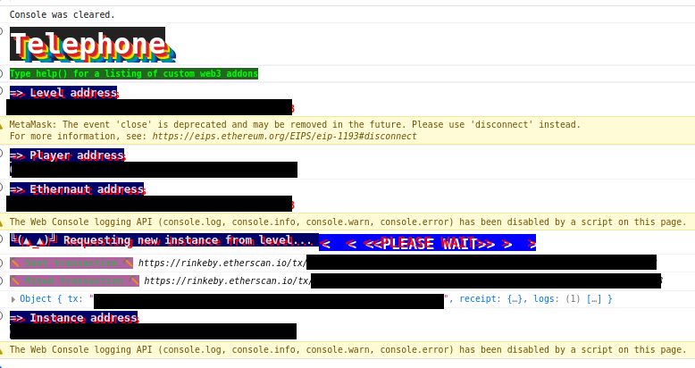
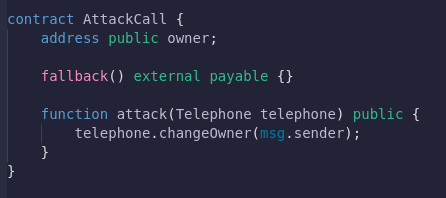
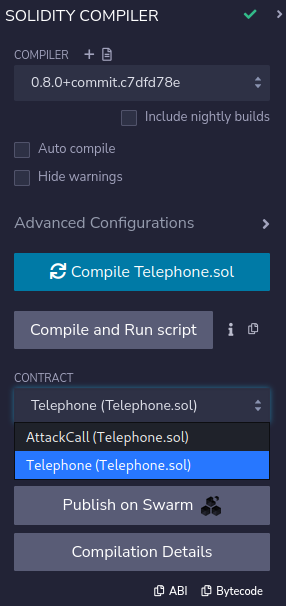
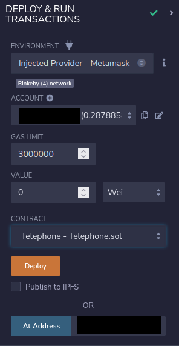
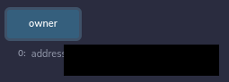
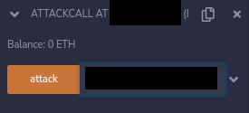
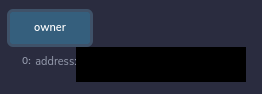

# 04: Telephone

The Ethernaut is a Web3/Solidity based wargame inspired by overthewire.org, played in the Ethereum Virtual Machine, in which each level is based on a smart contract that needs to be "hacked".

This is a sample walkthrough for the level called "Telephone".

## Setup

First off we need a wallet. Get the Metamask Wallet from https://metamask.io/ and choose whichever network works for you ( in my case i will be using Rinkeby's testnet).
Fund the wallet with Chainlink's faucet https://faucets.chain.link/rinkeby and then click on the button "Get new instance" to deploy the contract.

## Steps for completing the level
Click on F12 to get on Developer Tools. You will get something like this:

Go on Remix: https://remix.ethereum.org/ and make these changes in Telephone.sol. 

Copy the Telephone.sol contract found before "submit instance" and "get new instance" buttons.

At Telephone.sol i made these next changes:
>- <value> 1. Pragma version from **0.6.0** to **0.8.0** 

Just like the past level i searched about the difference between tx.origin and msg.sender, where i managed to find more information in this video : https://www.youtube.com/watch?v=mk4wDlVB4ro. This level wants from us to become the owner of the contract, only if we manage somehow to make the **tx.origin** who stands for the **sender of the transaction** different than the **msg.sender**, who's **the sender of the message**. Because we are unnable to do that in the same contract, we are going to build another contract, who's gonna attack the Telephone contract and will switch the ownership of the contract to us. The other contract that we build will be similar to the famous "Reetrancy Attack" 

More about Reentrancy Attack and how it works: https://solidity-by-example.org/hacks/re-entrancy/.

Just like the CoinFlip level, go and create a similar contract called AttackCall, below of the Telephone.sol one and add the global variables, fallback function and the attack function:
>- <value> address owner;
>- <value> fallback() external payable {} 
>- <value> function attack(Telephone telephone) public {
>- <value> telephone.changeOwner(msg.sender);}

It should look something like this:

Compile both contracts:

Now instead of deploying Telephone.sol we are going to interact with the already deployed contract by using instance address showed on Developer Tools and we will be deploying ourselves the AttackCall.sol contract to the Rinkeby's Testnet. Also, dont forget to add your wallet on Environment by selecting "Injected Provider - Metamask".

After deploying Telephone.sol we can see that the owner of the contract is the level's address of Telephone:

Go and paste the instance's address of the Telephone level that you have into the attack section and hit "attack" button:

After that, try and check owner function:

Wow, congrats!! Now you are the owner of the contract.

Now finish the level by using the submit button at the bottom of the page.

Congrats! See you on to the next level.:wave:
